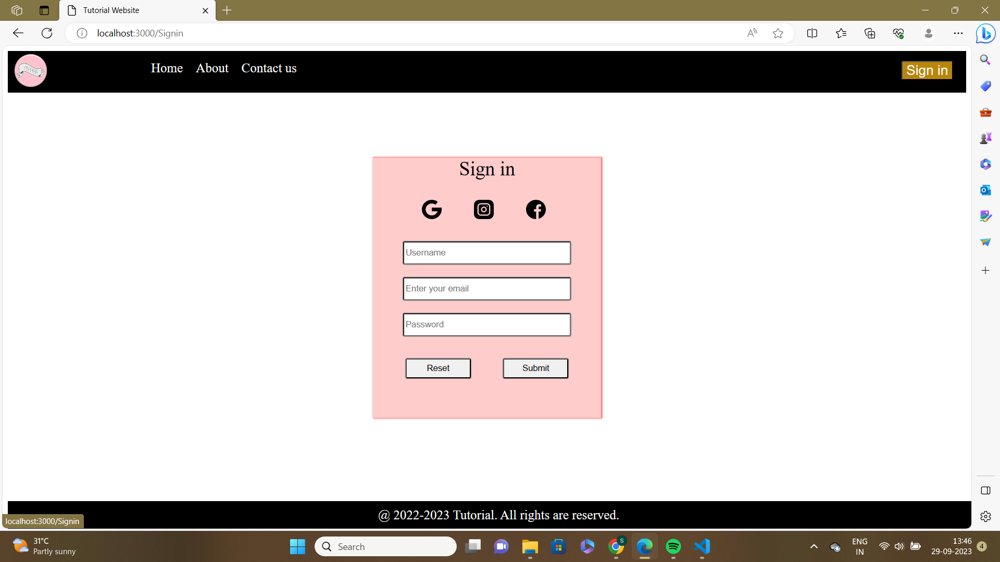

# Routing in React
## Library used:  *react-router-dom*
**command for installing react-router-dom:** `javascript
npm i react-router-dom`<br/>
**import dependencies:** `import {RouterProvider, createBrowserRouter, Link} from 'react-router-dom'`<br/><br/>
create an variable for routing as path and element pair in index.js<br/>
```javascript
const variable_name = createBrowserRouter(
[
{path: '...',
 element: 'component_call'},

{path: '...',
 element: 'component_call'},

{path: '...',
 element: 'component_call'},
]
)
```
Inside root.render<br/>
`<RouterProvider router={variable_name}/>`<br/><br/>
## <u>Homepage</u>

<br/><br/>
<br/><br/>
## <u>Signin Page</u>

